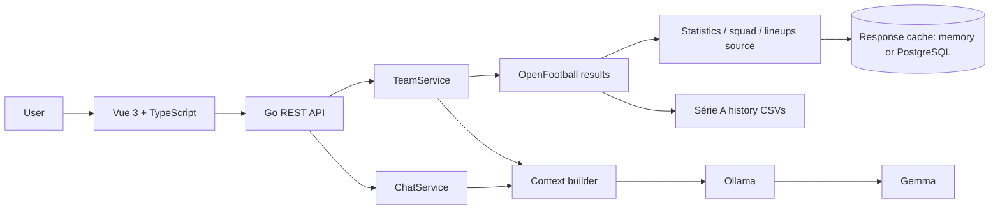

# MatchMind

**Your local AI analyst for Brazilian football.** · *Seu analista de futebol brasileiro com IA local.*

[](https://github.com/Darrkkens/matchmind/actions/workflows/ci.yml)
[](LICENSE)

MatchMind is a Brasileirão dashboard with a Vue 3 interface (in Brazilian Portuguese), a Go REST API and an **open-weight model (Gemma) running locally through Ollama**. Pick a club and see the league table, recent form, the last matches with statistics, scorers, cards and lineups, 20+ seasons of Série A history, and ask an AI analyst questions that are answered only from that data.


- **No account, no cloud AI, no API key required.** Optional keys only add more statistics.
- **Facts first.** Every number comes from a cited source or a deterministic Go calculation; the AI separates `FATO` from `INTERPRETAÇÃO` and must say when data is missing.
- **Honest about coverage.** Missing data stays missing; the UI shows sources, retrieval times and notices.

## Contents

[Features](#features) · [Quick start](#quick-start) · [Data sources](#data-sources) · [Open-source AI](#open-source-ai) · [Architecture](#architecture) · [Configuration](#configuration) · [API](#api) · [Security](#security-and-operational-scope) · [Tests](#tests-and-builds) · [Contributing](#contributing) · [Hacktoberfest 2026](#hacktoberfest-2026) · [License](#license)

## Features

- **Brasileirão table** computed from the season's results, with all 20 club crests, indicative Libertadores / Sul-Americana / relegation zones, and click-to-analyze.
- **Club search** by name, nickname (`Galo`, `Timão`, `Verdão`…) or a public team URL (parsed locally as text, never fetched).
- **Recent form**: W/D/L sequence, goals, average and points percentage.
- **Next scheduled match** (opponent, date, kick-off time, home or away) and the **last five matches** with possession, shots, shots on target, corners, fouls and cards; **goal scorers** (with assists, penalties and own goals), **bookings**, **stadium** and **referee**.
- **"Ver escalações"**: both team sheets on demand — formation, coach, starters, substitutes, minutes, ratings, goals and cards.
- **Squad** with appearances, goals, assists and ratings.
- **Série A history 2003–2024**: titles, season-by-season position/points/coaches/averages, the club's top scorers, discipline, and head-to-head records with scorers of the last meetings.
- **Season panel** (optional, local FBref CSV export): attack, defense and discipline per match against the league average with ranks, home/away records, top scorer, assists leader, goalkeeper, average attendance and home stadium.
- **Next-match preview and simulation**: both clubs' last five results, home/away records and season numbers side by side, and a Monte Carlo simulation (50, 1,000 or 10,000 matches) with win/draw/loss percentages, expected goals and the most simulated scores. See [Next-match simulation](#next-match-simulation).
- **AI chat** in Portuguese with quick questions, cited context sections and clear limits.
- Responsive dark UI, keyboard navigation, loading/error/offline states; dashboard works without the AI.

<details>
<summary>More screenshots</summary>

| Landing page and table | Lineups | Série A history |
| --- | --- | --- |
|  |  |  |

| Real local Gemma answer | Mobile |
| --- | --- |
|  |  |

Captured on October 2, 2026 from the running application with real data. The chat image shows an actual Gemma 3 4B response, not a mock. See the [screenshot guide](docs/screenshots/README.md).

</details>

## Quick start

Requirements: **Go 1.25+**, **Node.js 22.12+** and npm. For the chat: **[Ollama](https://ollama.com)** with enough RAM for the model (CPU works, but answers take 1–3 minutes). Docker is optional.

```sh
git clone https://github.com/Darrkkens/matchmind.git
cd matchmind
cp .env.example .env            # optional: defaults work without it

# 1. Local AI (only needed for the chat)
ollama serve                    # skip if the Ollama service is already running
ollama pull gemma3:4b

# 2. Backend (another terminal)
cd backend && go run ./cmd/server

# 3. Frontend (another terminal)
cd frontend && npm install && npm run dev
```

Open **http://localhost:5173**, click a club in the table or search for one.

<details>
<summary>Installing Ollama</summary>

Ollama is a separate application; `npm install` and `go run` do not install it. On Arch/CachyOS: `sudo pacman -S --needed ollama`. For other systems follow the [official instructions](https://docs.ollama.com/linux). GPU acceleration is optional.

</details>

**Optional extras**

| Want | Do |
| --- | --- |
| Match statistics, squads and lineups (free, no key) | Set `ALMANACSTATS=on` in `.env` — read its [terms](#match-statistics-and-lineups-optional) first |
| Statistics from a paid/free-plan API | Set `API_FUTEBOL_KEY` or `API_FOOTBALL_KEY` |
| Keep API responses across restarts (saves quota) | `docker compose up -d` and set `DATABASE_URL` (see `.env.example`) |

The backend loads `.env` automatically from the working directory or its parent; variables already set in the shell win. The log line `loaded environment file` confirms it.

## Data sources

MatchMind never scrapes websites or calls private endpoints. Every outgoing URL is built from a fixed host and an allowlist; browser input never chooses an endpoint.

| Data | Source | License / terms | Required |
| --- | --- | --- | --- |
| Results, table, form | [OpenFootball](https://github.com/openfootball/football.json) | CC0-1.0 | Yes (default) |
| Série A history 2003–2024 | [Brasileirao_Dataset](https://github.com/adaoduque/Brasileirao_Dataset) by Adão Duque ([Kaggle](https://www.kaggle.com/datasets/adaoduque/campeonato-brasileiro-de-futebol)) | GPL-2.0, fetched at runtime, not bundled | On by default |
| Match stats, events, squads, lineups | [AlmanacStats API](https://almanacstats.com/pt-br/api-docs) | Personal, non-commercial use (see below) | Off by default |
| Match stats (alternative) | [API-Futebol](https://www.api-futebol.com.br), [API-Football](https://www.api-football.com) | Their plans and terms; key required | Off |
| Club crests | Wikimedia Commons and official sources | Per file, see [credits](frontend/public/crests/credits.html) | Bundled |

### Results and table: OpenFootball

The default dataset is [Brasileiro Série A 2026](https://raw.githubusercontent.com/openfootball/football.json/master/2026/br.1.json). It supplies team names, dates, rounds and final scores — nothing else. The app uses the last five scored matches dated up to today in that dataset (not other competitions), shows the club's next dated, non-postponed fixture from it, accepts both published score formats, and distinguishes a 0–0 draw from a missing score. Names are matched case- and accent-insensitively, with Brazilian nicknames as aliases.

The table uses the Brasileirão criteria available from scores: points, wins, goal difference, goals scored (head-to-head and disciplinary criteria are not modeled). The dataset is cached in memory for five minutes, with coalesced downloads and a 15-second cooldown after failures; an unavailable source produces an explicit error, never substitute data. Supported leagues: `br.1` (all features), `en.1`, `de.1`, `es.1`, `it.1`, `fr.1` (results and table only).

### Match statistics and lineups (optional)

Sources are used in this order when enabled: **AlmanacStats** (`ALMANACSTATS=on`) → **API-Futebol** (`API_FUTEBOL_KEY`) → **API-Football** (`API_FOOTBALL_KEY`). A match receives data only when round/date, both clubs and the final score agree with OpenFootball; otherwise its statistics stay `null`. Failures never block the dashboard: `data_metadata.statistics_notice` explains them.

- **AlmanacStats** (free, keyless) provides team statistics, goal and card events, stadium, referee, lineups and squads. MatchMind requests only the opened club (its profile plus up to five match pages), at most one request per second as the provider asks, and credits it in the UI.
  > **Terms of use.** The API page invites free use with caching and attribution, but the site's [Terms and Conditions](https://almanacstats.com/terms-and-conditions) allow only personal, non-commercial use and forbid extracting substantial parts of the data, redistribution, derivative datasets and using the platform to "train, fine-tune or evaluate" AI models without a licence. MatchMind only passes the data to a local model as answer context and trains nothing, but a strict reading could still apply. It is **off by default**; ask AlmanacStats for written permission before using it beyond personal use.
- **API-Futebol** (championship 10): rounds are linked by number. Test keys (`test_…`) return the same sample match for every request, so the UI labels them "dados de exemplo" and the backend appends a warning to AI answers that use them.
- **API-Football** (league 71): the season fixture list is cached for six hours and finished matches forever, to stay within the free plan's 100 requests/day.

**Response cache.** Every statistics response is cached: finished matches never expire, open rounds and profiles after hours, 404s after 6 hours. With `DATABASE_URL`, the cache lives in PostgreSQL (`api_responses` table, `jsonb`) and survives restarts; `docker compose up -d` starts PostgreSQL 18 on `127.0.0.1:5435` with credentials from `.env`. Without it, the cache is in memory.

### Série A history (2003–2024)

All four CSV files of the dataset are used: results, stadiums, coaches and formations (required), plus scorers (2014–2024), bookings (2014–2024) and per-match statistics (optional). For each club the snapshot's `history` contains titles, the all-time record, `seasons` (final position, points, record, coaches by matches in charge, formation, home stadium and per-match averages), `top_scorers` (own goals excluded), `discipline`, and head-to-head records with the last five `meetings` (stadium and scorers).

Titles and positions come from each complete season's final table and match the official champions for 2003–2024. Seasons are inferred from dates (2020 ended in February 2021). Averages are computed only where the source actually filled them (2017–2023; 2016 and 2024 rows are mostly zeros). Scorers are shown only when they add up to the final score. Player and coach names appear as recorded by the source (often full legal names). A missing optional file is listed in `history.unavailable`. The dataset is cached for 12 hours; set `BRASILEIRAO_HISTORY=off` to disable it.

### Season statistics: local FBref export (optional)

Set `FBREF_DIR` to a folder of CSV exports of FBref's Série A tables (`times_padrao`, `times_finalizacao`, `times_finalizacao_adversarios`, `times_goleiros`, `times_diversos`, `classificacao`, `classificacao_casa_fora`, `jogos`, `jogadores_padrao`, `goleiros`). The folder is read once at start-up; nothing is downloaded. Clubs are matched to OpenFootball names through the shared aliases. The snapshot then carries `season_stats` (and `next_opponent_season`), the stadium becomes the venue of most home matches, and the UI shows the data date. FBref/Sports Reference terms restrict scraping and reuse: keep these files out of the repository and use them only locally. A missing file or column disables the source with a warning in the log.

### Next-match simulation

`POST /api/simulate` estimates the club's next fixture in three steps:

1. **Base model (Go).** Poisson expected goals from each club's season attack and defense in the OpenFootball table (shrunk toward the league average) and the league's home edge, adjusted by bounded factors: season detail from FBref (goals and shots on target, for and against), each club's own home/away scoring, the last five results, rest (3 days or fewer, or 3+ matches in 10 days, cost goals) and the head-to-head record (Série A since 2003 plus this season, weighted by sample size).
2. **AI analyst (Ollama).** With `use_ai`, the local model receives a compact summary of those facts and returns a bounded adjustment for each side (±15%) with a short reason; it becomes the `ai_analyst` factor. If the model is offline or too slow, the simulation continues without it and says so.
3. **Draws (Go).** Each simulated match varies both sides' strength (log-normal, ±20% typical) and draws goals; the seed comes from the fixture and run count, so the same request repeats exactly.

The percentages always come from the draws, never from the language model. Explaining a simulation in the chat reuses the AI-reviewed result the user just ran, prints its exact numbers first and lets the model explain the factors. **Injuries** are listed as a factor but are not used: no configured source provides them. Rest only counts league matches in the dataset. This is a statistical estimate, not a forecast.

### Club crests

All 20 Série A 2026 crests are bundled locally; nothing is fetched from third parties while using the dashboard. Unknown clubs and failed images fall back to initials. Provenance, authors, licenses and SHA-256 hashes are in the [crest manifest](frontend/public/crests/manifest.json) and the [credits page](frontend/public/crests/credits.html).

Seventeen files are public domain on Wikimedia Commons and the Corinthians image is CC BY-SA 4.0 (by Fratino.koko). **The current RB Bragantino (Red Bull trademark, from the club's official site) and Vasco (marked as restricted content on Portuguese Wikipedia) crests are not freely licensed**; they are included only to identify the clubs and will be removed if the rights holders object. Crest files are **not covered by the MIT license**. See [crest maintenance](docs/club-crests.md).

### Adding another authorized provider

1. Verify the provider's documented API, license, terms, quotas and redistribution rights. Do not scrape or reverse engineer private endpoints.
2. Implement `FootballProvider` (`backend/internal/football/provider.go`), or `StatisticsSource` / `SquadSource` / `LineupSource` to enrich OpenFootball results.
3. Return completed matches newest first, propagate `context.Context`, set timeouts, and use `nil`/empty values for missing data — never fabricated zeros.
4. Wire it in `cmd/server/main.go` behind explicit configuration; keep credentials in backend environment variables only.
5. Add `httptest` fixture tests and document provenance, freshness and limits.

## Open-source AI

[Ollama](https://github.com/ollama/ollama) runs [Gemma 3](https://ai.google.dev/gemma/docs/core/model_card_3) (default [`gemma3:4b`](https://ollama.com/library/gemma3:4b)) through its documented [`POST /api/chat`](https://docs.ollama.com/api/chat), with structured JSON output and a low temperature. With the default loopback `OLLAMA_URL`, questions and context never leave your machine. Gemma weights follow the [Gemma terms](https://ai.google.dev/gemma/terms) and are not included in this repository.

How answers stay grounded:

- The browser cannot send context. For each question the backend rebuilds the club snapshot and sends the model a compact JSON context (no URLs or artwork), including the full table, history, or squad **only when the question is about them**, so CPU inference stays within the timeout.
- The system prompt treats all data as untrusted evidence, forbids prior football knowledge and invented facts, and explains coverage rules (e.g. player totals are not recent-match goals; own goals belong to the other side).
- Ollama returns `facts`, `interpretation` and `sources_used`; Go validates the structure and the allowed source names and adds the `FATO` / `INTERPRETAÇÃO` labels itself. When statistics come from a test key, Go appends the sample-data warning instead of trusting the model to mention it.

These are behavioral controls, not a guarantee: a 4B model can still omit or misread data. Check answers against the visible numbers. Larger models (`OLLAMA_MODEL=gemma3:12b`) follow the instructions better if your hardware allows.

## Architecture



```text
matchmind/
├── backend/
│   ├── cmd/server/            # Configuration, .env loading, HTTP server
│   └── internal/
│       ├── api/               # Routes, validation, CORS, rate and concurrency limits
│       ├── football/          # Providers, models, table, form, history, sources
│       ├── footballtest/      # Fictional in-memory provider used only by tests
│       ├── service/           # Team snapshots and chat orchestration
│       ├── store/             # PostgreSQL response cache (pgx)
│       └── ai/                # Ollama client, system prompt, context builder
├── frontend/
│   ├── public/crests/         # Club crests, manifest and credits
│   └── src/                   # App, components, API client, types, styles
├── docs/                      # Testing notes, crest maintenance, research, screenshots
├── .github/                   # CI, issue and pull request templates
├── docker-compose.yml         # Optional PostgreSQL
└── .env.example
```

## Configuration

| Variable | Default | Meaning |
| --- | --- | --- |
| `API_ADDR` | `127.0.0.1:8080` | API listening address |
| `OPENFOOTBALL_LEAGUE` | `br.1` | League file code from the allowlist |
| `OPENFOOTBALL_SEASON` | `2026` | Season directory, e.g. `2026` or `2026-27` |
| `BRASILEIRAO_HISTORY` | `on` | `off` disables the Série A history download (`br.1` only) |
| `ALMANACSTATS` | `off` | `on` enables AlmanacStats statistics, squads and lineups (`br.1`); read its terms |
| `API_FUTEBOL_KEY` | empty | API-Futebol key for match statistics (`br.1`) |
| `API_FOOTBALL_KEY` | empty | API-Football key for match statistics (`br.1`) |
| `DATABASE_URL` | empty | PostgreSQL URL for the response cache; empty keeps it in memory |
| `POSTGRES_DB`, `POSTGRES_USER`, `POSTGRES_PASSWORD`, `POSTGRES_PORT` | see `.env.example` | Used by `docker compose` |
| `CORS_ORIGINS` | `http://localhost:5173,http://127.0.0.1:5173` | Exact allowed origins, comma-separated |
| `OLLAMA_URL` | `http://localhost:11434` | Inference host; never supplied by a request |
| `OLLAMA_MODEL` | `gemma3:4b` | Installed Ollama model |
| `OLLAMA_TIMEOUT` | `240s` | Inference timeout (max `10m`); the browser waits up to 260 s |
| `VITE_API_URL` | empty | Frontend API origin without `/api` (`frontend/.env.local` or build env) |

Never commit `.env`; it is git-ignored. If you change the backend port, update the Vite proxy or `VITE_API_URL`, and keep `CORS_ORIGINS` in sync with the frontend origin.

## API

POST requests require `Content-Type: application/json`; unknown fields and trailing JSON are rejected; bodies are limited to 16 KiB. Errors are `{"error": "..."}` in Portuguese.

| Endpoint | Purpose |
| --- | --- |
| `GET /api/health` | `status` (`ok`/`degraded`), `ollama` (daemon up and model installed), `football_provider`, `data_source` |
| `POST /api/team/resolve` `{"input": "Palmeiras"}` | Club snapshot: `team`, `recent_matches` (with `statistics`, `goals`, `cards`, `venue`, `referee`, `lineup_ref`), `recent_form`, `standings`, `squad`, `trophies`, `history`, `data_notice`, `data_metadata` |
| `GET /api/standings` | League table with competition, season, source URL and retrieval time |
| `GET /api/lineups/{ref}` | Both team sheets for a match's numeric `lineup_ref` (400 if invalid, 404 if unavailable) |
| `POST /api/simulate` `{"team_id": "...", "runs": 10000, "use_ai": true}` | Next-fixture simulation: `win_pct`, `draw_pct`, `loss_pct`, expected goals, `top_scorelines`, `factors` (multipliers and reasons), last five results of both sides and `notes`; `runs` 1–10000 (default 50). With `use_ai` it shares the single inference slot (429 when busy). 404 when no fixture is scheduled |
| `POST /api/chat` `{"team_id": "...", "question": "..."}` | `{"answer": "FATO: …\n\nINTERPRETAÇÃO: …", "sources_used": [...]}` |

```sh
curl -s http://localhost:8080/api/team/resolve -H 'Content-Type: application/json' -d '{"input":"Palmeiras"}'
curl -s http://localhost:8080/api/chat -H 'Content-Type: application/json' \
  -d '{"team_id":"TEAM_ID_FROM_RESOLVE","question":"Como foi o desempenho nos últimos 3 jogos?"}'
```

Use the returned `team.id` for chat. The backend is stateless: each question is answered on its own, so follow-ups that depend on a previous answer are not reliable. Common statuses: 400 invalid input, 404 not found, 413 body too large, 415 content type, 429 rate or one-inference-at-a-time limit, 502 invalid upstream data, 503 AI/provider unavailable, 504 timeout.

## Security and operational scope

- User URLs are parsed locally; there is no arbitrary URL retrieval. Lineup references must be numeric.
- Provider data is encoded as JSON separate from the system prompt and treated as untrusted; the model has no tools, shell or HTML rendering, and Vue renders text escaped (no `v-html`).
- Exact-origin CORS, body limits, one concurrent inference and a global 120 requests/minute window protect the local app. Upstream calls have timeouts, size limits, no redirects, failure cooldowns and (AlmanacStats) a 1 request/second limit.
- API keys and database credentials stay in the backend environment and are never sent to the browser.
- The API binds to loopback by default. CORS is not authentication: this is a trusted local application, not a hardened multi-user service. See [SECURITY.md](SECURITY.md).

## Tests and builds

```sh
cd backend
gofmt -l .                 # must print nothing
go vet ./...
go test -race ./...

cd ../frontend
npm ci
npm run build              # vue-tsc type checking + Vite build
```

Tests use local `httptest` servers and fakes — never real APIs or a real model. They cover URL/name resolution and nicknames, form and table calculations, every data source (matching rules, caching, rate limiting, plan/quota errors, test keys), history parsing (seasons, champions, scorers, cards, averages), lineup and name matching, `.env` loading, AI context selection and response validation, API validation, CORS and rate limits. CI runs these checks on every push and pull request. See [testing notes](docs/testing.md) for manual checks.

## Troubleshooting

| Symptom | Check |
| --- | --- |
| API offline | Start `go run ./cmd/server` in `backend/` and check port 8080. |
| "Estatísticas indisponíveis" everywhere | No statistics source is enabled: set `ALMANACSTATS=on` or a key in `.env`, restart the backend and look for `match statistics enabled` in the log. |
| Local AI offline | Start Ollama, run `ollama list`, pull the configured model, then click the connection status. |
| AI answer times out | CPU inference is slow; close heavy apps, keep `OLLAMA_TIMEOUT=240s` or try a smaller model. |
| Club not found | Only clubs in the configured league/season exist; try the club's common name. |
| OpenFootball unavailable | Check access to `raw.githubusercontent.com`, then retry after 15 seconds. |
| Origin is not allowed | Put the exact frontend origin (scheme and port) in `CORS_ORIGINS`. |
| Port already in use | Stop the earlier server; Vite dev and preview both use port 5173. |

## Contributing

Contributions are welcome — bug reports, data-quality fixes, tests, docs and features. Read [CONTRIBUTING.md](CONTRIBUTING.md) and the [Code of Conduct](CODE_OF_CONDUCT.md). Ideas that would help:

- More leagues with history and statistics (Série B, Copa do Brasil) from openly licensed sources.
- Club and match comparison; player pages.
- Reproducible evaluations of answer grounding with local models.
- Carefully bounded conversation context for follow-up questions.

## Hacktoberfest 2026

MatchMind was created for **[Hacktoberfest 2026](https://hacktoberfest.com)**, whose theme is *"AI belongs to everyone"* — building with open-weight models and open-source AI. It was built for the [Weekend Challenge — Build for a Friend](https://dev.to/challenges/hacktoberfest-weekend-2026-10-01) (tag `hf26challenge`), with Gemma running locally as the core of the experience. See the [preparation checklist](docs/hacktoberfest-checklist.md).

In 2026, pull requests no longer count toward Hacktoberfest rewards, so there is no PR quota here — thoughtful, tested contributions are what we are looking for.

### AI assistance

Development was assisted by an AI coding assistant (Claude Code), directed and reviewed by the maintainer. Data, screenshots and the sample model answer come from running the real application; nothing in this repository is presented as real data or a real model answer unless it is one.

## License

Code: MIT — see [LICENSE](LICENSE). Not covered by the MIT license: Gemma weights ([Gemma terms](https://ai.google.dev/gemma/terms)), football data from the sources above (their own licenses and terms; the GPL-2.0 history dataset is downloaded at runtime, not bundled), and club crests (individual licenses or trademarks; see the [credits](frontend/public/crests/credits.html)).
